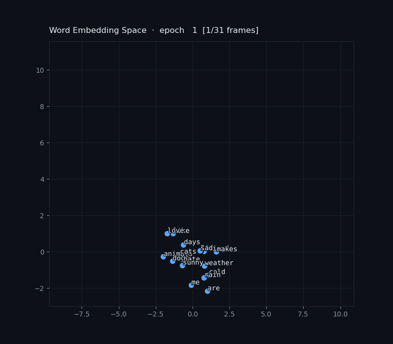

# mini-embedding

> A minimal Word2Vec implementation built from scratch to understand how neural language models learn meaning.


---

## What this is

This repository implements a minimal **Skip-gram Word2Vec** model using pure PyTorch — no pre-trained weights, no shortcuts. The goal is to build the most fundamental building block of modern NLP from first principles and make the math visible in code.

It is the first step toward understanding how large language models work. Below a table with link to the next steps.

---

## Core concept

An **embedding** is a trainable lookup table — a matrix of shape `(vocab_size × embedding_dim)` — that maps a discrete word index to a continuous vector:

```
"cats"  →  index 2  →  [0.12, -0.70, 0.33, 0.91, ...]
"dogs"  →  index 3  →  [0.14, -0.65, 0.31, 0.88, ...]
"rain"  →  index 5  →  [-0.60, 0.10, -0.42, 0.05, ...]
```

The key insight is that this matrix is **learned**, not hand-crafted. The model is trained to predict context words from a target word (Skip-gram objective). As training progresses:

- words that appear in similar contexts drift toward each other in vector space
- words with opposite contexts drift apart

After training, **geometric distance encodes semantic similarity**:

```
cosine_similarity("cats", "dogs")  →  0.97   ✓ close
cosine_similarity("cats", "rain")  →  0.12   ✓ distant
```

This is the same principle used by Word2Vec, GloVe, and — at a much larger scale — the token embedding layers of GPT and BERT.

---

## Deep dive — theory & code walkthrough

The [`THEORY.md`](./THEORY.md) file covers everything in depth, including:

- Why integer IDs and one-hot vectors fail as word representations
- What the embedding matrix actually is and how it is initialized
- The Skip-gram objective and how meaning emerges from co-occurrence
- **A full explanation of the neural network architecture** — why the embedding is not a separate process but the first layer of the network, how backpropagation updates each row, and what the output actually is (not a matrix of similar words, but a probability distribution)
- Line-by-line code walkthrough of every source file
- End-to-end data flow trace from raw text to a weight update
- How this connects to GPT and BERT

> If you are confused about how the embedding matrix relates to the neural network, or how training actually updates the weights, start with **[Section 6 of THEORY.md](./THEORY.md#6-the-embedding-is-the-neural-network--clearing-up-the-confusion)**.

---

## Architecture

```
word index
    │
    ▼
┌─────────────────────────────────────┐
│  Embedding  (vocab_size × emb_dim)  │  ← the matrix we are training
└─────────────────────────────────────┘
    │
    ▼  embedding vector  (1 × emb_dim)
┌─────────────────────────────────────┐
│  Linear     (emb_dim × vocab_size)  │
└─────────────────────────────────────┘
    │
    ▼  logits  (1 × vocab_size)
CrossEntropyLoss  vs  true context word
```

Training signal flows backward through the linear layer and directly into the embedding matrix, nudging each word's vector based on which context words it co-occurs with.

---

## Project structure

```
mini-embedding/
│
├── data/
│   └── corpus.txt          # training corpus (plain text, one sentence per line)
│
├── src/
│   ├── dataset.py          # tokenization and skip-gram pair generation
│   ├── model.py            # Word2Vec architecture (Embedding + Linear)
│   ├── train.py            # training loop (Adam, CrossEntropyLoss)
│   ├── utils.py            # cosine similarity and nearest-neighbor search
│   └── visualize.py        # 2-D embedding plots and loss curves
│
├── outputs/                # saved embeddings (.pt) and plots (.png)
├── main.py                 # end-to-end entry point
├── requirements.txt
└── README.md
```

---

## Quickstart

```bash
# 1. Clone the repository
git clone https://github.com/your-username/mini-embedding.git
cd mini-embedding

# 2. Create and activate the conda environment
conda env create -f environment.yml
conda activate mini-embedding

# 3. Run the full pipeline
python main.py
```

> **GPU users** — edit `environment.yml`, remove the `cpuonly` line, and replace it with `pytorch-cuda=12.1` (or match your CUDA version). Then re-create the environment.

To deactivate or remove the environment later:

```bash
conda deactivate
conda remove -n mini-embedding --all
```

Expected output:

```
── Loading corpus ──────────────────────────────────
TextDataset(vocab_size=16, pairs=180, window_size=2)
  Vocabulary : ['I', 'and', 'animals', 'are', 'cats', 'cold', ...]

Word2Vec(vocab_size=16, embedding_dim=8)

── Training ────────────────────────────────────────
Epoch [  1/150]  Loss: 43.2810
Epoch [ 10/150]  Loss: 38.1024
...
Epoch [150/150]  Loss: 18.4392

── Nearest Neighbors ──────────────────────────────
      cats  →  dogs (0.971), animals (0.843), like (0.612)
      dogs  →  cats (0.971), animals (0.831), like (0.598)
      rain  →  cold (0.923), hate (0.801), sad (0.744)
      like  →  love (0.887), cats (0.612), dogs (0.598)
────────────────────────────────────────────────────

Embeddings saved → outputs/embeddings.pt
```


---

## Configuration

All hyperparameters are set at the top of `main.py`:

| Parameter | Default | Description |
|---|---|---|
| `EMBEDDING_DIM` | `8` | Dimensionality of each word vector. Use `2` for direct 2-D visualization. |
| `WINDOW_SIZE` | `2` | Number of context words on each side of the target. |
| `EPOCHS` | `150` | Training iterations over the full dataset. |
| `LEARNING_RATE` | `0.01` | Adam optimizer learning rate. |
| `QUERY_WORDS` | see file | Words to evaluate with nearest-neighbor search. |

---

## Choosing embedding dimension

The dimensionality is a design choice with real trade-offs:

| Size | Use case |
|---|---|
| 2–10 | Learning / visualization |
| 50–300 | Classic Word2Vec / GloVe |
| 768 | BERT base |
| 1024–4096 | GPT-style models |

Too small: the model cannot capture enough structure.  
Too large: overfitting on small corpora, slower training.

---

## How this connects to LLMs

This project is a scaled-down version of the input layer of every modern language model:

```
GPT / BERT pipeline
───────────────────
token index  →  Embedding layer  →  Transformer blocks  →  output
                     ↑
              same concept as here
```

In GPT, each token is mapped to a 768-D or 4096-D vector before being processed by attention layers. The embedding matrix is trained jointly with the rest of the model on a next-token prediction objective — a direct extension of what this project does.

---

## What's next

This repository is the first step in a series building toward a minimal transformer:

- [x] **mini-embedding** — Skip-gram Word2Vec ← *you are here*
- [x] [**mini-attention**](https://github.com/JeffreyRed/mini-self-attention) — scaled dot-product self-attention from scratch
- [x] [**mini-transformer**](https://github.com/JeffreyRed/mini-transformer)— positional encoding + multi-head attention + feedforward block
- [x] [**mini-gpt**](https://github.com/JeffreyRed/mini-gpt) — next-token language model trained on real text
- [ ] [**mini-chat**](https://github.com/JeffreyRed/mini-chat) — create a chatbot with a bigger database but still small for educational purpose
- [ ] [**mini-cross-attention**](https://github.com/JeffreyRed/mini-cross-attention) — understand cross-attention.

---

## References

- Mikolov et al. (2013) — [Efficient Estimation of Word Representations in Vector Space](https://arxiv.org/abs/1301.3781)
- Mikolov et al. (2013) — [Distributed Representations of Words and Phrases](https://arxiv.org/abs/1310.4546)
- Firth (1957) — *"You shall know a word by the company it keeps"*

---

## License

MIT
